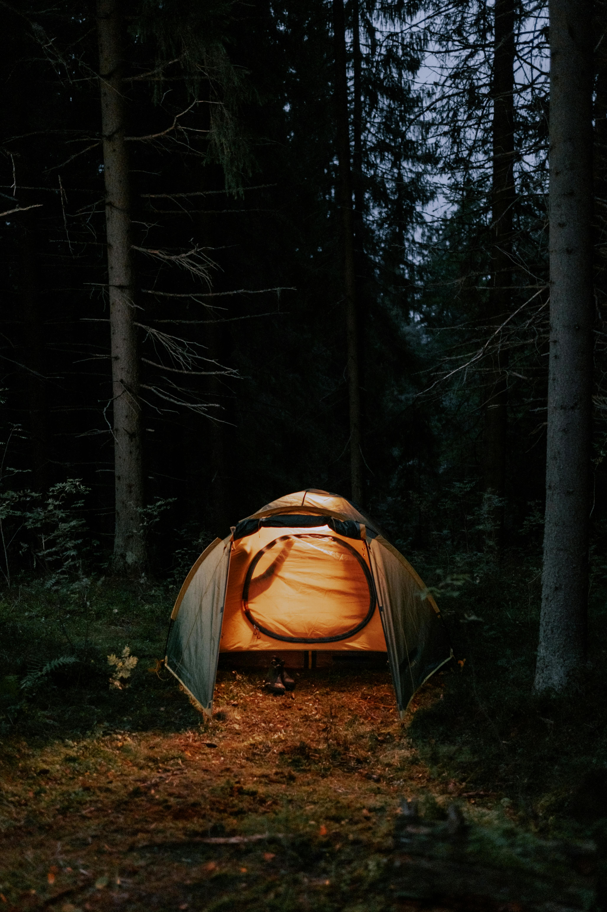
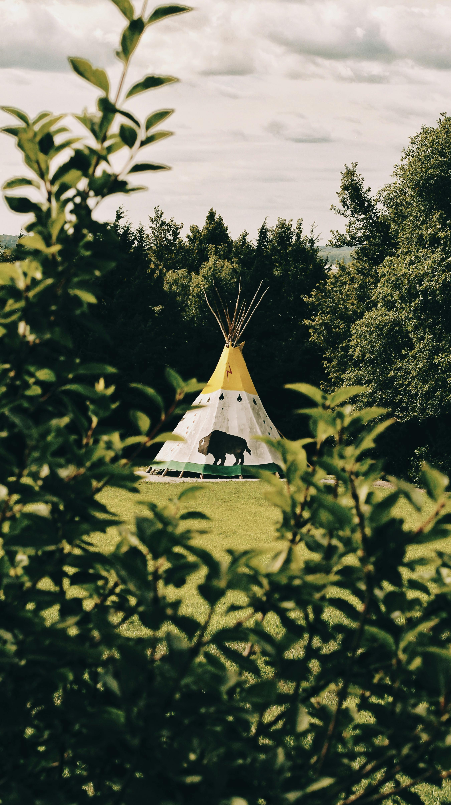
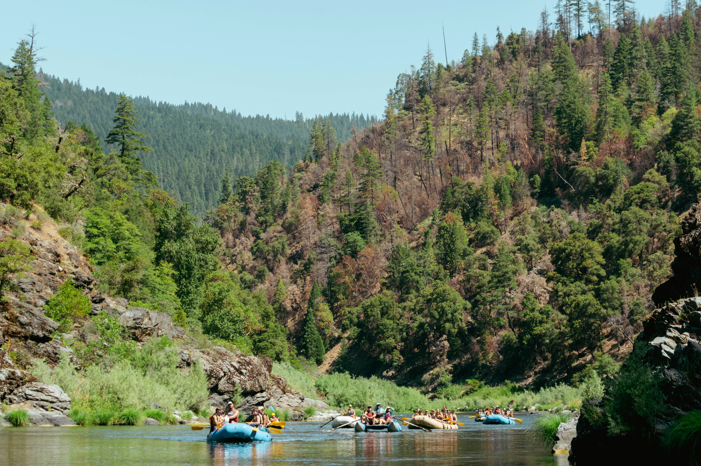

::: {.hero}

  <video class="hero-video" autoplay muted loop playsinline preload="metadata" poster="images/hero.jpg">
    <source src="media/hero-fire.mp4" type="video/mp4">
  </video>

::: {.hero-inner}

[Letní voda pro přátele]{.eyebrow}

# Vodák 2026

::: {.lead}
Čtyři dny na Vltavě, pohoda na vodě, večery u ohně a pár dní, kdy se svět kolem na chvíli zpomalí.
Tady najdeš všechny důležité informace na jednom místě.
:::

::: {.hero-meta}
**Termín akce:** 26.–30. června 2026  
**Řeka:** Vltava  
**Sraz:** 26. června večer – Ubytovna / Kemp Pod Hrází  
**Vyplutí:** 27. června v 10:00
:::

:::

::: {.quick-nav .quick-nav-hero}
[Základní info](#zakladni-info)
[Ubytování](#ubytovani)
[Plavidla](#plavidla)
[Program](#program)
[Co s sebou](#co-s-sebou)
[Doprava](#doprava)
[Dotazy](#faq)
[Kontakt](#kontakt)
:::
:::

## Základní info {#zakladni-info}

::: {.info-grid}

::: {.info-card}
### Akce
Víkendový vodák pro přátele a známé.
:::

::: {.info-card}
### Termín
26.–30. června 2026  
Splouvání 27.–30. června
:::

::: {.info-card}
### Trasa
Vyšší Brod → Boršov nad Vltavou
:::

::: {.info-card}
### Obtížnost
Vhodné i pro lidi bez zkušeností.
:::

::: {.info-card}
### Styl akce
Pohodová voda, žádný závod, večer posezení.
:::

::: {.info-card}
### Potvrzení účasti
Dej vědět přes formulář, ať máme přehled o lidech, autech a lodích.
:::

:::

## Ubytování {#ubytovani}

::: {.packing-grid}

::: {.packing-card .packing-card-photo .stay-card}
::: {.packing-body}

### Stan

200 Kč / osoba / noc

<ul class="stay-list">
  <li>stan: <strong>200 Kč / noc</strong></li>
  <li>čím více lidí ve stanu, tím levněji vychází cena na hlavu</li>
  <li>orientačně při 2 lidech: <strong>300 Kč / noc na hlavu</strong></li>
  <li>orientačně za 4 noci: <strong>1 200 Kč / osoba</strong></li>
</ul>

<strong>Výhoda:</strong> větší soukromí

:::

  

:::

::: {.packing-card .packing-card-photo .stay-card}
::: {.packing-body}

### Teepee

200 Kč / osoba / noc

<ul class="stay-list">
  <li>pronájem teepee: <strong>1 000 Kč / noc</strong></li>
  <li>kapacita: <strong>až 12 lidí</strong></li>
  <li>orientačně při plném obsazení: <strong>283 Kč / noc na hlavu</strong></li>
  <li>orientačně za 4 noci: <strong>1 133 Kč / osoba</strong></li>
</ul>

<strong>Výhoda:</strong> nikdo nemusí stavět ani skládat stan

:::

  

:::

:::
## Plavidla {#plavidla}

::: {.program-grid}

::: {.program-card}
### Kajak

**Pro 1 osobu**

- cena: <strong>470&nbsp;Kč / den</strong>
- orientačně celkem na hlavu: <strong>1&nbsp;880&nbsp;Kč</strong>
:::

::: {.program-card}
### Baraka

**Pro 2 osoby**

- cena: <strong>550&nbsp;Kč / den</strong>
- orientačně celkem na hlavu: <strong>1&nbsp;100&nbsp;Kč</strong>
:::

::: {.program-card}
### Raft

**Pro 4 osoby**

- cena: <strong>1&nbsp;050&nbsp;Kč / den</strong>
- orientačně celkem na hlavu: <strong>1&nbsp;050&nbsp;Kč</strong>
:::

::: {.program-card}
### Raft XL

**Pro 6 osob**

- cena: <strong>1&nbsp;290&nbsp;Kč / den</strong>
- orientačně celkem na hlavu: <strong>860&nbsp;Kč</strong>
:::

:::

::: {.callout-note}
### Poznámka k cenám
Uvedené ceny jsou aktuální orientační ceny **bez slevy**. Předpokládám minimálně **10% slevu** za věrnost a větší skupinu, takže finální částky mohou být ještě o něco nižší.
:::

## Program {#program}

::: {.program-grid}

::: {.program-card}
### 26. června – příjezd
Příjezd večer do Ubytovna / Kemp Pod Hrází. Večer sraz, ubytování a příprava na vyplutí.
:::

::: {.program-card}
### 27. června – 1. den
Vyplutí v 10:00 z Vyššího Brodu. Cíl: Kemp U Fíka (Náhořany), přibližně 21 km.
:::

::: {.program-card}
### 28. června – 2. den
Pokračování do Kempu Krumlov, přibližně 17 km.
:::

::: {.program-card}
### 29. června – 3. den
Pokračování do Kempu U Kelta, přibližně 20 km.
:::

::: {.program-card}
### 30. června – 4. den
Doplujeme do Boršova – Kemp Poslední Štace, přibližně 12 km.
:::

::: {.program-card}
### 30. června odpoledne – odjezd
Předpokládaný odjezd z Boršova po obědě.
:::

:::

## Co s sebou {#co-s-sebou}

::: {.packing-grid}

::: {.packing-card .packing-card-photo}
::: {.packing-body}
### Na vodu

- boty do vody
- náhradní suché věci
- opalovací krém
- pokrývka hlavy
- drobná lékárnička
- pláštěnka
:::

  

:::

::: {.packing-card .packing-card-photo}
::: {.packing-body}
### Na večer a spaní

- spacák
- karimatka nebo matrace
- mikina / teplejší vrstva
- hygienické potřeby
- ručník
- dobrou náladu
:::

  

:::

:::

::: {.callout-tip}
### Doporučení
Kempingové vybavení a zásoby budu převážet autem z kempu do kempu vždy ráno před vyplutím. Pokud tedy vyloženě nechceš, nemusíš všechno tahat na lodi. Díky tomu bude na lodi větší komfort a zároveň ušetříme i za občerstvení po cestě.

Z mojí zkušenosti nafukovací matrace zabere méně místa než karimatka a zároveň se na ní spí pohodlněji. Beru s sebou aku fukar, se kterým je matrace nafouknutá zhruba za minutu.

Na cennosti, které chceš mít na vodě po ruce, použij vodotěsný obal. Jestli nemáš, napiš mi. Třeba ještě budu mít nějaký na půjčení.
:::

## Doprava {#doprava}

::: {.transport-grid}

::: {.transport-card}
### Sraz
Sraz je 26. června večer v Ubytovna / Kemp Pod Hrází. Kdo nebude chtít dorazit už večer, může přijet i 27. června ráno před vyplutím.
:::

::: {.transport-card}
### Přesun a auta
Poprosím o informaci ve formuláři, jestli můžeš vzít auto nebo naopak potřebuješ odvoz. Podle toho doladíme dopravu tam i zpět.
:::

:::

[Zobrazit místo srazu na mapě](https://maps.app.goo.gl/gx4KaU8oaHqXmULD6){.map-btn}

## Dotazy {#faq}

Musím mít zkušenosti s vodou?

Nemusíš. Tahle varianta je plánovaná tak, aby ji zvládli i lidi, kteří nejsou zkušení vodáci.

Co když dorazím až 27. června ráno?

Je to v pohodě. Sraz je sice už 26. června večer, ale kdo chce, může dorazit až 27. června ráno před vyplutím.

Jak budeme řešit lodě a posádky?

Preference posádek a lodí posbíráme přes formulář a následně to doladíme ručně, ať to dává smysl.

Na kolik mě to tedy odhadem vyjde?

Počítej přibližně s <strong>cca 2 200 Kč za ubytování a vybavení</strong>. Zbytek je už hodně individuální a bude záležet hlavně na dopravě — tedy odkud jedeš, kolik lidí pojede v autě a jak se rozdělí palivo.

Další položkou bude to, kolik kdo utratí za jídlo a pití. Občerstvení podél řeky bývá zpravidla dost drahé. Pokud to chceš pojmout víc low cost, zaměř se hlavně na vlastní zásoby. Díky každodennímu převozu věcí autem a chladicím boxům to nemusí vyjít draze.

  

## Kontakt {#kontakt}

::: {.contact-grid}

::: {.contact-card}
### Organizátor
Jakub Kozlok  
*Kozlík / Moučný červ*
:::

::: {.contact-card}
### Mobil
[+420 777 168 341](tel:+420777168341)
:::

::: {.contact-card}
### Potvrzení účasti
Vyplň prosím formulář, ať máme přehled o lidech, dopravě a posádkách.
:::

:::

::: {.final-cta}
## Chceš jet s námi?

Potvrď účast přes formulář a pomoz nám doladit dopravu, lodě i organizaci.

[Potvrdit účast](https://tally.so/r/9qlzB5){.final-cta-btn}
:::
