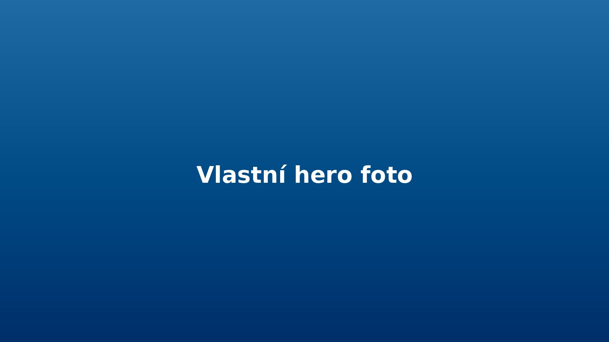

::: {.hero}

  Letní voda pro přátele
  <h1>Vodák 2026</h1>
  

    Dva dny na řece, pohoda na vodě, večer u ohně a minimum chaosu.
    Tady najdeš všechny důležité informace na jednom místě.
  

  

    
<strong>Termín:</strong> 12.–14. června 2026

    
<strong>Řeka:</strong> Sázava

    
<strong>Sraz:</strong> pátek 18:00, Praha / dle domluvy

  

  

    <a class="btn-main" href="https://forms.gle/TVUJ-ODKAZ-SEM">Potvrdit účast</a>
    <a class="btn-secondary" href="#zakladni-info">Zobrazit info</a>
  

:::

::: {.quick-nav}
[Základní info](#zakladni-info)
[Program](#program)
[Co s sebou](#co-s-sebou)
[Doprava](#doprava)
[FAQ](#faq)
[Fotky](#fotky)
[Kontakt](#kontakt)
:::

## Základní info {#zakladni-info}

- **Akce:** víkendový vodák pro přátele a známé
- **Termín:** 12.–14. června 2026
- **Trasa:** Týnec nad Sázavou → Pikovice
- **Obtížnost:** vhodné i pro lidi bez velkých zkušeností
- **Styl akce:** pohodová voda, žádný závod

## Stručný program {#program}

### Pátek
Příjezd, přesun na místo, ubytování / kemp, společný večer.

### Sobota
Hlavní úsek na vodě, zastávky po cestě, večer posezení.

### Neděle
Kratší dojezd, sbalení věcí, návrat domů.

## Co s sebou {#co-s-sebou}

- rychleschnoucí oblečení
- boty do vody
- náhradní suché věci
- spacák a hygienu
- opalovací krém
- hotovost / kartu
- dobrou náladu

::: {.callout-tip}
### Doporučení
Cennosti dej do vodotěsného obalu a neber zbytečně moc věcí. Čím míň chaosu, tím lepší víkend.
:::

## Doprava a sraz {#doprava}

Sraz dáme v pátek v podvečer. Kdo pojede autem, doplní ve formuláři počet volných míst. Kdo potřebuje svézt, vyplní to taky tam.

**Mapa / místo srazu:** [Otevřít v Google Maps](https://maps.google.com)

## FAQ {#faq}

Musím mít zkušenosti s vodou?

Nemusíš. Tahle varianta je plánovaná tak, aby ji zvládli i lidi, kteří nejsou zkušení vodáci.

Co když si ještě nejsem jistý?

Ve formuláři můžeš zvolit i variantu „Asi jo, ale ještě nevím“. Aspoň budeme mít orientační přehled.

Jak budeme řešit lodě a posádky?

Každý ve formuláři uvede preferenci lodě a případně s kým chce sedět. Finální rozdělení udělá organizátor ručně v Google Sheetu.

## Fotky {#fotky}

::: {.gallery}
{.gallery-img fig-alt="Řeka a loďky"}
{.gallery-img fig-alt="Pauza u vody"}
{.gallery-img fig-alt="Večerní atmosféra"}
:::

## Potvrzení účasti

::: {.cta-card}
### Jedu / nejedu? Dej vědět přes formulář

Formulář sbírá jen odpovědi. Web slouží jen jako přehled informací.

[Otevřít Google Form](https://forms.gle/TVUJ-ODKAZ-SEM){.btn-main}
:::

## Kontakt {#kontakt}

**Organizátor:** Jakub  
**Telefon:** +420 000 000 000  
**E-mail:** jakub@example.com
